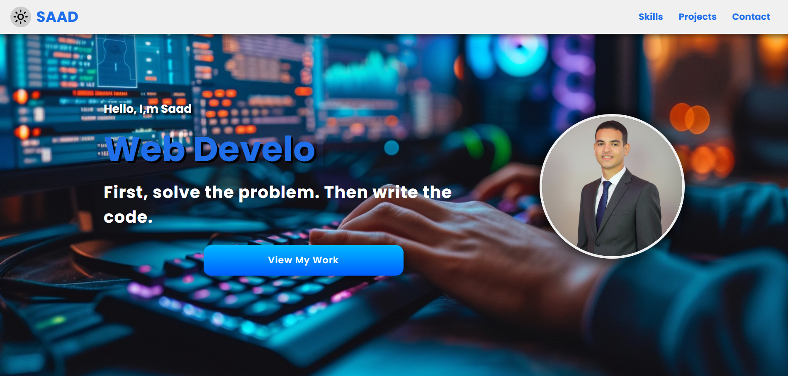

# My Portfolio

## 🌐 Live Demo
https://saadcodes3.github.io/MyPortfolio/

## 📸 Preview


This is my personal portfolio website developed to showcase my skills and projects in Front-End Development.

The project is built using core web technologies with a strong focus on responsive design, performance, and user experience.

---

## 📄 Resume
[Download my CV](assets/Saad_AlHusseiny_CV.pdf)

---

## 🛠️ Technologies Used
- HTML
- CSS (Responsive Design)
- JavaScript

---

## ✨ Features
- Fully responsive layout for all screen sizes
- Dark and Light mode toggle
- Typing animation (typewriter effect)
- Scroll-to-top button for better user experience
- Responsive mobile navigation menu
- Interactive UI animations and hover effects
- About Me, Skills, Projects, and Contact sections

---

## 📂 Project Structure
- `index.html` – Main structure of the website  
- `style.css` – Styling and responsive layout  
- `script.js` – JavaScript interactions (dark mode, animations, etc.)  
- `images/` – Website images and screenshots  
- `assets/` – CV and additional files  

---

## 🚀 How to Run Locally
1. Clone the repository:
   ```bash
   git clone https://github.com/SaadCodes3/MyPortfolio.git
